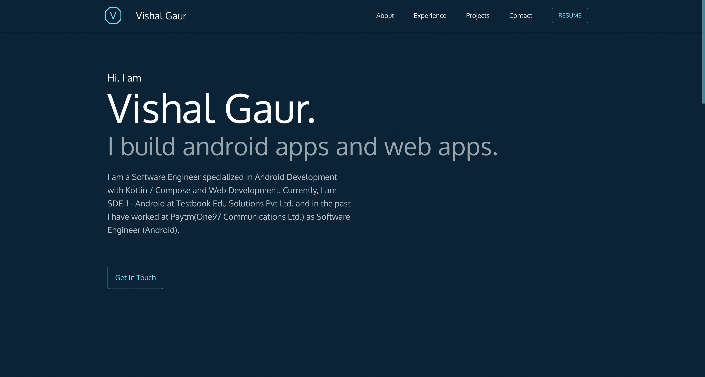

<div align="center">
  
</div>
<h1 align="center">
  my-portfolio
</h1>
<p align="center">
  This is my personal website built with <a href="https://nextjs.org/" target="_blank">Next.js</a> and hosted with <a href="https://vercel.com/" target="_blank">Vercel</a>
</p>



## :hammer_and_wrench: Project setup

```
npm install
```

### Run the development server:

```bash
npm run dev
# or
yarn dev
```

<p align="center"> Made with ❤️ by <a href="https://github.com/i-vishi">Vishal Gaur</a></p>